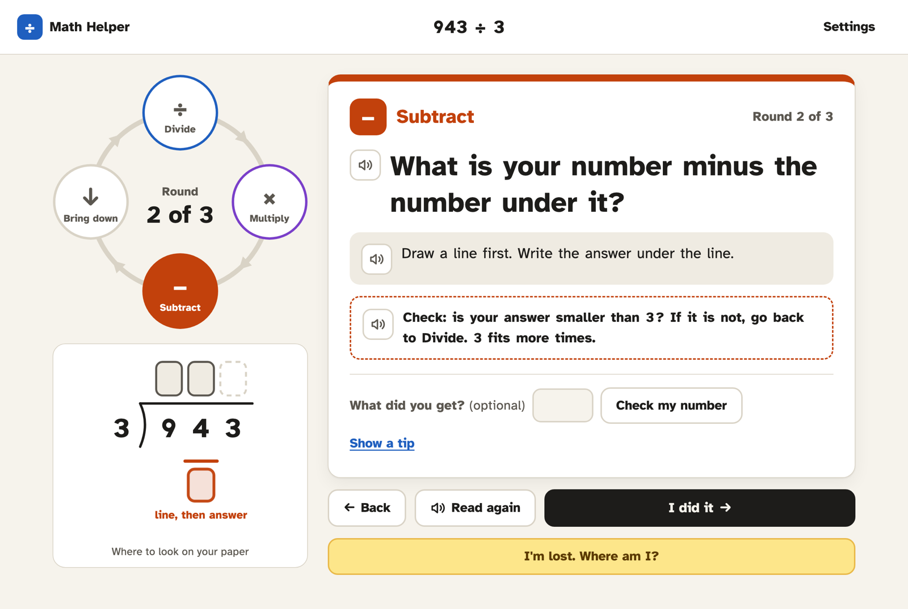

# Math Helper

A web app that coaches students with math-related learning disabilities (including dyscalculia) through multi-step math problems, starting with long division. It works as a spoken, step-by-step flowchart.

**▶ Try it: https://mattnupen.github.io/math-helper/**

**▶ 🎬 **Watch how we made it:** [Making EdTech, Episode 1](https://youtu.be/ZKZEFbjNo28)**



> **Origin:** This project began as a design conversation with Claude:
> https://claude.ai/share/a8d07fc9-f406-4499-89f2-91d14b12b361


## What it does now

- **Keep the Beat.** A student types a problem, such as `943 ÷ 3`, and works it on paper. The app walks through **Divide → Multiply → Subtract → Bring down** one step at a time. For each step it reads the question aloud and highlights each word as it's spoken. A four-step ring shows the current step and round, and a sketch shows *where on the paper* to look. The sketch never shows numbers the student hasn't worked out yet.
- **Where am I?** A student who gets lost partway through presses one button and answers two questions they can answer just by looking at their paper: "How many digits are on top?" and "Which picture looks like your paper?" The app finds their place and takes them straight to the next step. If the paper doesn't match any step, it offers to start the problem again.
- **Check my number (optional).** A student can type what they got. The app only says "Yes, that matches" or "Not quite", then offers a strategy tip. It never gives the answer.
- **Teacher links.** Type a list like `943/3, 937/5, 1074/15` to get a link. When students open it, the problems are ready. There's no login and no server, and nothing is sent anywhere.
- **Settings.** Reading speed, voice, and whether each step is read aloud automatically.

Speech uses the browser's built-in voices. It works best in Chrome, Edge, or Safari on a computer.

## The problem

Students with learning disabilities get stuck partway through multi-step problems such as `943 ÷ 3` or `380 × 16`. They forget the steps and don't know how to get unstuck. They also don't know which question to ask themselves next. Worked examples are hard to read back through, and students often forget to use a resource unless an adult reminds them.

This is a gap in knowing what to do next, more than in doing the arithmetic. Tools like Photomath tell students *what to do*, but these students need help knowing *what to ask themselves*.

## Who it's for

- Students age 10 and older who struggle with math, including students with dyscalculia
- Homework is done on paper; the app coaches and does not do the arithmetic
- Runs as a web app on computers with large screens
- Every instruction is spoken aloud (text-to-speech), and each word is highlighted as it is read

## Goals for v1 (in priority order)

1. Students get unstuck without an adult
2. Students learn the questions well enough to use them on paper without the app
3. Fewer wrong answers and less frustration
4. Teachers can see where students get stuck

## Design principles

- **The coaching questions are written by hand, not generated.** Students learn the questions by hearing the exact same words every time ("How many 3s fit in 9?"). AI can be used to read problems and generate practice items, but not for the coaching voice.
- **The app never sees the student's paper work.** It only needs to know which step the student is on and what question comes next. It never gives the answer.
- **Numbers are read aloud one digit at a time where the step needs it.** When a step works on "9", the app says "nine", not "nine hundred forty-three".
- **Photo input reads the printed problem only.** It does not read handwritten work. A false "you're wrong" from the app does more harm than giving no feedback.

## Concepts

1. **"Where Am I?" (the recovery ladder).** When a student is lost mid-problem, they press one button. The app asks a few yes/no and tap questions about what is written on their paper, such as "Is anything written above the division bar?" From the answers it works out which step they are on and speaks only the next question.
2. **"Keep the Beat" (the loop companion).** Opened before starting a problem. Long division repeats four steps: **Divide, Multiply, Subtract, Bring Down**. A simple screen shows which step and which round the student is on (for example "Round 2 of 3") and reads the current question aloud.
3. **"The Twin" (a parallel spoken example), planned for v2.** The app makes up a problem with the same structure (for example `862 ÷ 2` for `943 ÷ 3`) and walks through it one step at a time, out loud. Then it hands the student's own problem back to them.

Concepts 1 and 2 use the same underlying model of the steps, with two ways in. One starts at the beginning of a problem and the other starts from the middle when a student is stuck.

## v1 scope (built)

- Long division only, with up to 6-digit dividends and 1- or 2-digit divisors
- Problems are typed in
- No backend: everything runs in the browser, and problems are stored in the URL. Teachers assign a set of problems by sharing a link, with no login needed.

## Running it locally

It's a static site with no build step. Serve the folder and open it:

```bash
python3 -m http.server 8000
```

Then go to http://localhost:8000. Opening `index.html` directly from disk won't work, because the browser blocks JavaScript modules loaded from `file://` pages.

Run the tests (Node 20+):

```bash
npm test
```

## Code map

| File | What it holds |
| --- | --- |
| `js/division.js` | The long-division steps (rounds, next/previous step, "Where am I?" lookup). Has no page code. |
| `js/script.js` | The coaching words. Every question is fixed text; only numbers from the problem change. |
| `js/words.js` | Numbers as spoken words, so speech says "threes", not "3 s". |
| `js/speech.js` | Text-to-speech with word-by-word highlighting |
| `js/app.js` | Screens, routing (all state lives in the URL), and the step ring and paper sketches |
| `tests/` | Tests for the step model, the "Where am I?" lookup, and the fixed wording |

## Later

- Multi-digit multiplication
- Photo capture of printed worksheet problems
- A teacher view of where students get stuck
- "The Twin" parallel examples
